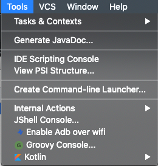
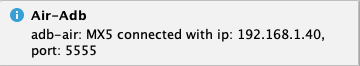

<p align="center">
  
</p>

Air-Adb: A plugin for debugging Android Apps via Wifi
=========

Requirements
--------------------------------------
 - Linux, OS X, Windows 10 ([WSL is needed](https://docs.microsoft.com/en-us/windows/wsl/install-win10))
 - Android Studio or IntelliJ 
 
Installation
--------------------------------------
[Install Air-Adb plugin from Jetbrains repository](https://plugins.jetbrains.com/plugin/12651-air-adb)

Usage
--------------------------------------
Tools -> Enable Adb over wifi\
\
Unplug your device and start debugging\


Change adb path
--------------------------------------
if your Adb is not installed in the default folder you need to change the bash script that Air-Adb installs.
```shell
#For OSX use this one-liner changing my_path with your current path
MY_PATH="my_path" && ex -sc "6d|x" ~/.air-adb/air-adb.sh && ex -sc "6i|OSX_ADB_DEFAULT_PATH=$MY_PATH" -cx ~/.air-adb/air-adb.sh

#For Linux use this one-liner changing my_path with your current path
MY_PATH="my_path" && ex -sc "7d|x" ~/.air-adb/air-adb.sh && ex -sc "7i|LINUX_ADB_DEFAULT_PATH=$MY_PATH" -cx ~/.air-adb/air-adb.sh

```

License
--------------------------------------
MIT License

Copyright (c) 2019 Felipe Herranz

Permission is hereby granted, free of charge, to any person obtaining a copy
of this software and associated documentation files (the "Software"), to deal
in the Software without restriction, including without limitation the rights
to use, copy, modify, merge, publish, distribute, sublicense, and/or sell
copies of the Software, and to permit persons to whom the Software is
furnished to do so, subject to the following conditions:

The above copyright notice and this permission notice shall be included in all
copies or substantial portions of the Software.

THE SOFTWARE IS PROVIDED "AS IS", WITHOUT WARRANTY OF ANY KIND, EXPRESS OR
IMPLIED, INCLUDING BUT NOT LIMITED TO THE WARRANTIES OF MERCHANTABILITY,
FITNESS FOR A PARTICULAR PURPOSE AND NONINFRINGEMENT. IN NO EVENT SHALL THE
AUTHORS OR COPYRIGHT HOLDERS BE LIABLE FOR ANY CLAIM, DAMAGES OR OTHER
LIABILITY, WHETHER IN AN ACTION OF CONTRACT, TORT OR OTHERWISE, ARISING FROM,
OUT OF OR IN CONNECTION WITH THE SOFTWARE OR THE USE OR OTHER DEALINGS IN THE
SOFTWARE.
